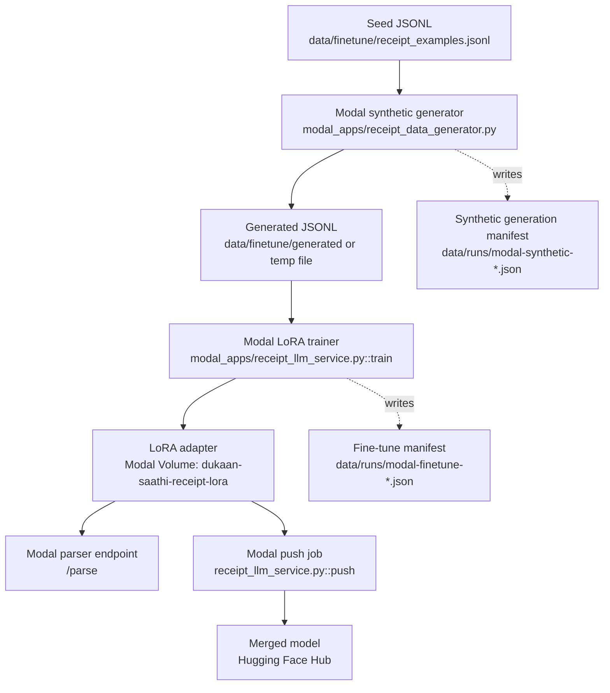
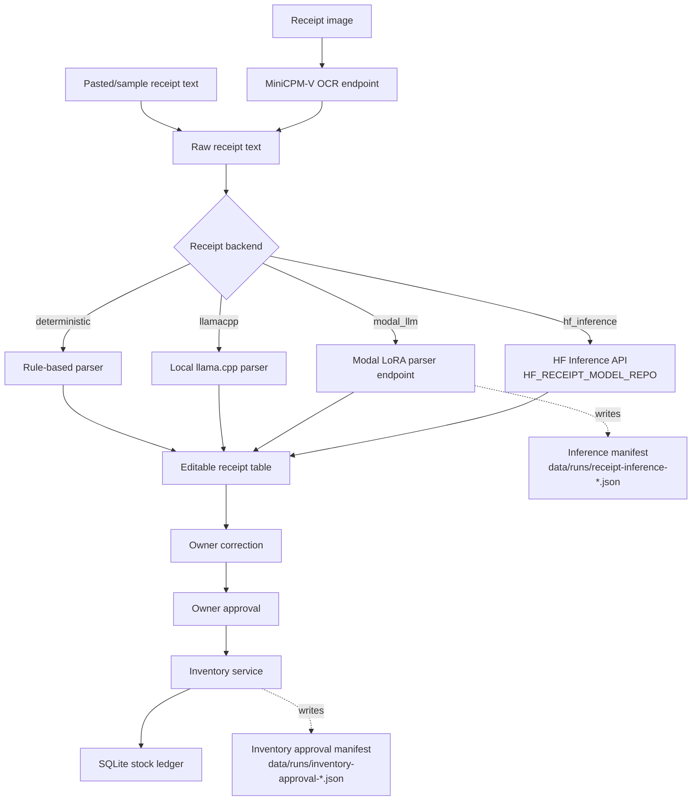

# Pipeline Traceability

Dukaan Saathi uses static diagrams for explanation and JSON run manifests for
auditability. The diagrams show the intended system shape. The manifests under
`data/runs/` record what actually happened in a local, Modal-backed, or
HF-backed run.

## Fine-tuning DAG



The fine-tune manifests include dataset paths, SHA256 hashes, record counts,
model IDs, training parameters, Modal app names, and final status. They do not
store Modal tokens or Hugging Face tokens.

## Inference DAG



Inventory changes remain approval-gated. Model output can only create editable
candidate rows; approved stock changes go through
`dukaan_saathi/services/inventory.py`.

## Runtime Artifacts

`TRACE_DIR` controls where manifests are written. The default is:

```text
data/runs/
```

These files are local runtime evidence and are ignored by git.
